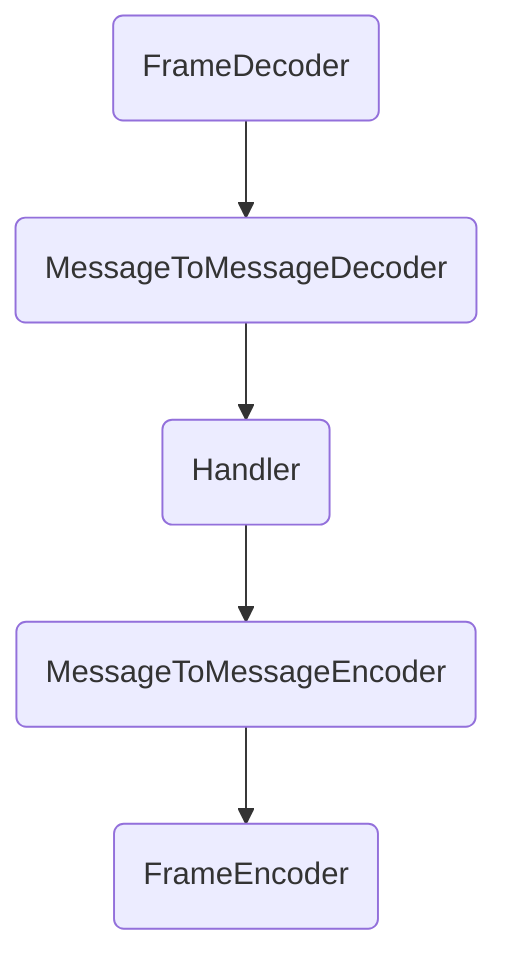

[toc]

#  第一章：初识 Netty：背景、现状与未来趋势

## 1. 揭开 Netty 面纱

- 本质：一个网络应用程序框架

- 实现：异步、事件驱动

- 特性：高性能、可维护、快速开发

- 用途：开发服务器和客户端


## 2. 为什么不直接使用 JDK NIO ？

1. 经典的 epoll bug：异常唤醒空转导致 CPU 100%，并且官方的 Resolution 为 Won't Fix， Netty 则是检测问题发生，然后处理。

2. IP_TOS 参数（ IP 包的优先级和 QoS 选项）使用时抛出异常，JDK 直到 12 才解决， Netty 则是遇到该参数时直接返回 false 绕过以解决问题。

3. JDK的 NIO 一些 API 不够友好，功能薄弱，例如 `ByteBuffer -> Netty‘s ByteBuf`。除了 NIO 外，也提供了一些其他增强： `Threadlocal -> Netty’s FastThreadLocal`。

4. Netty 能够隔离变化、屏蔽细节：隔离 JDK NIO 的实现变化： `nio -> nio2(aio)` 以及屏蔽 JDK NIO 的实现细节。

5. 自己时直接使用 JDK NIO实现会遇到很多问题，可以参照 Netty 解决的 NIO 问题。

   

6. Netty 有活跃的社区支持。

## 3. Netty 的发展

从版本演变上看发展：

- 2004 年 6 月 Netty2 发布，声称 Java 社区中第一个基于事件驱动的应用网络框架
- 2008 年 10 月 Netty3 发布
- 2013 年 7 月 Netty4 发布
- 2013 年 12 月发布 5.0.0.Alpha1
- 2015 年 11 月废弃 5.0.0

其中废弃 Netty 5 的原因是因为其复杂性增加， 但却没有带来明显的性能优势。从这里也可以看出，使用开源软件一般不要使用Alpah、Beat版本。


# 第二章 Netty 源码：从“点”（领域知识）的角度剖析

## 1. 什么是经典的三种 I/O 模式

|     I/O模式      |            时间点            |
| :--------------: | :--------------------------: |
|  BIO（阻塞I/O）  |          JDK1.4之前          |
| NIO（非阻塞I/O） | JDK1.4（2002年，java.nio包） |
|  AIO（异步I/O）  |       JDK1.7（2011年）       |

其中 BIO 是同步阻塞 I/O， NIO 是同步非阻塞 I/O，AIO 是异步非阻塞 I/O。

- 此处需要区分阻塞、非阻塞以及同步、异步的区别：


- 阻塞：没有数据传过来的时候，会一直等待直到有数据；
- 非阻塞：非阻塞在遇到阻塞的情况时会直接返回而不是等待。

阻塞、非阻塞注重于第一阶段。

- 同步：数据就绪后需要发起者自己去取数据。
- 异步：数据就绪后不需要发起者自己去取数据。

同步、异步注重于第二阶段。

## 2. Netty 对三种 I/O 模式的支持


- **为什么不建议（deprecate）阻塞 I/O（BIO/OIO）?**

  BIO 在连接数高的情况下：阻塞 -> 耗资源、效率低。

- **为什么删掉已经做好的 AIO 支持？**
  
  - Windows 实现成熟，但是很少用来做服务器。
  - Linux 常用来做服务器，但是 AIO 实现不够成熟。
  - Linux 下 AIO 相比较 NIO 的复杂度上升，且性能提升不明显 。

Netty 可以很轻松的切换 I/O 模式，只需要改变 `EventLoopGroup` 以及 `ServerSocketChannel` 的类型即可：

|          NIO           |          OIO           |
| :--------------------: | :--------------------: |
|   NioEventLoopGroup    |   OioEventLoopGroup    |
| NioServerSocketChannel | OioServerSocketChannel |

这是借助 工厂模式 + 反射 + 泛型 实现的，并且不需要切换 `SocketChannel ` 的类型，因为 `SocketChannel ` 是 `ServerSocketChannel` 创建出来的。

## 3. Netty 如何支持三种 Reactor

| BIO                   | NIO     | AIO      |
| --------------------- | ------- | -------- |
| Thread-Per-Connection | Reactor | Proactor |

Reactor 是一种开发模式，模式的核心流程：
注册感兴趣的事件 -> 扫描是否有感兴趣的事件发生 -> 事件发生后做出相应的处理。


### 3.1 Reactor 模式 V1：单线程


 此时，所有 I/O 操作（accept、read、write、 connect）以及非 I/O 操作（业务处理等）都在一个线程上进行，这样单个线程的负载较大，可能会大大延迟 I/O 操作的响应。

### 3.2 Reactor 模式 V2：多线程


Reactor 多线程模式下，将非 I/O 操作分离出来，单独丢给线程池去执行，Reactor只负责 I/O 操作。但是所有 I/O 操作仍由 Reactor 一个线程分发执行，在 I/O 操作并发较高的时候，仍会出现瓶颈。

### 3.3 Reactor 模式 V3：主从多线程


主从多线程模式下，主 Reactor 主要用于监听客户端发起的连接事件，然后通过 acceptor 丢给 从 Reactor，从 Reactor 往往会起一个新的线程来处理 I/O 操作。

- **为什么要使用主从 Reactor 模式？**

  对 Server 端来说，**建立连接比其他事情都重要**，如果都丢在一个 Reactor 里，这时候对一个 Reactor 来说所有操作的优先级都是平等的，那么当 I/O 操作并发度很高的时候就容易导致连接超时。


- **Netty 如何支持主从 Reactor 模式的？**

通过上图表格中传入不同的 `EventLoopGroup` 即可实现 Reactor 模式的切换，并且注册到不同的 group。


- **为什么说 Netty 的 main reactor 大多并不能用到一个线程组，只能线程组里面的一个？**

服务端通常只会绑定一个端口，所以只会调用一次。

- **Netty 给 Channel 分配 NIO event loop 的规则是什么？**

`io.netty.bootstrap.ServerBootstrap.ServerBootstrapAcceptor#channelRead` 在给 channel 注册 event loop 的时候，根据 `EventExecutor` 的数量选择   `GenericEventExecutorChooser` 以及 `PowerOfTwoEventExecutorChooser` （必须是2的幂次方）两个静态内部类，两个静态内部内有不同的分配方式，前者直接哈希求余，后者通过位操作。

- **通用模式的 NIO 实现多路复用器是怎么跨平台的**？

若没有特殊指定，都是通过 JDK 的 `sun.nio.ch.DefaultSelectorProvider.create()` 来选择多路复用器的。

## 4. 半包和粘包

- **什么是粘包和半包？**

粘包，就是一次接收到了多条消息。

半包，一次接收到了不完整的消息。

- **为什么 TCP 应用中会出现粘包和半包现象？**

从发送端来看，出现粘包的原因是每次写入数据 < 套接字缓冲区大小。

从接收端来看，出现粘包的原因是套接字缓冲区 flush 数据不够及时。


从发送端来看，出现半包的原因是因为 写入数据 > 套接字缓冲区大小，或者发送的数据大于协议的 MTU（Maximum Transmission Unit，最大传输单元），必须拆包。


从收发角度来看，一次发送可能多次接收，多次发送可能一次接收。

从传输角度看，一次发送可能占用多个传输包，多个发送可能占用一个传输包。


- **为什么 TCP 应用中会出现粘包和半包现象？**

TCP 是流式协议，消息无边界，因此要解决粘包、半包问题，就得解决数据的 “边界” 问题。


解决数据 “边界” 有以下几种方式：


Netty 对其中三种常用方式也提供了支持：


## 5. 解读 Netty 处理粘包、半包的源码

- **为什么需要“二次”解码？**

前面解决粘包、半包的解码叫做一次解码器，主要是针对粘包、半包的问题，解码出来的结果是字节。如果需要能够给项目使用，还需要再进行一次处理，转化为可用的对象，第二次的处理我们称之为二次解码。

- **为什么需要“二次”编解码？**
  - 一次解码器：`ByteToMessageDecoder`：`io.netty.buffer.ByteBuf` （原始数据流）-> `io.netty.buffer.ByteBuf` （用户数据）
  - 二次解码器：`MessageToMessageDecoder<I>`：`io.netty.buffer.ByteBuf` （用户数据）-> Java Object

第一次编解码是为了解决粘包、半包问题，第二次编解码是为了解决数据的可操作性问题。其实编码、解码也可以一次解决，但是没有分层会导致结构不够清晰，造成耦合性，不容易灵活的置换方案。

- **常用的二次编解码方式？**

  Java 序列化
  Marshaling
  XML
  JSON
  MessagePack
  Protobuf
  其他

其中最常用的有 JSON、MessagePack 以及 Protobuf。

选择编码主要是根据**编码后占用空间**、**解码耗费的时间**来进行权衡，前面提到的三者都是较为优秀的方式，因此若要在三者中进行选择，又可以根据是否有对可读性的要求来进行选择，这里对 JSON 以及 MessagePack 举例对比：


相对的，可读性越好，往往编码占用空间以及解码速度就会变差，同时对编解码的选择还要看其是否支持多种语言平台。

### Google Protobuf 简介与使用

Netty 支持了很多种编解码器，其中 Protobuf 是 Netty 中相对较常用的一种编解码方式，但有一定的学习成本：


需要先编写 Protobuf 的文件并生成对应的接口文件，接下来在项目中使用就较为简单了：

```java
// 可变长度解码器
ch.pipeline().addLast(new ProtobufVarint32FrameDecoder());
ch.pipeline().addLast(new ProtobufDecoder(PersonOuterClass.Person.getDefaultInstance()));
// 可变长度编码器
ch.pipeline().addLast(new ProtobufVarint32LengthFieldPrepender());
ch.pipeline().addLast(new ProtobufEncoder())
```

## 6. keepalive 及 Idle

- **设置 TCP keepalive 怎么生效？**

```java
ServerBootstrap b = new ServerBootstrap();
            b.group(workerGroup)
             .channel(NioServerSocketChannel.class) // 工厂+反射
             .handler(new LoggingHandler(LogLevel.INFO))
             .childOption(ChannelOption.SO_KEEPALIVE, true)		// keepalive	X
             .childOption(NioChannelOption.SO_KEEPALIVE, true)	// keepalive	√
             .childHandler(new ChannelInitializer<SocketChannel>() {
                 @Override
                 public void initChannel(SocketChannel ch) throws Exception {
                     ChannelPipeline p = ch.pipeline();
                     p.addLast(new LoggingHandler(LogLevel.INFO));
                     p.addLast(serverHandler);
                 }
             });
```

- **两种设置 keepalive 的方式有什么区别？**

`NioChannelOption.SO_KEEPALIVE` 方式，当 JDK 版本 >=7 的时候，会针对 JDK 的 bug 做一些校验（比如不支持 IP_TOS）。

- **Idle检测包（io.netty.handler.timeout）的功能浏览？**

`IdleState` 有三种状态：① `READER_IDLE` ② `WRITER_IDLE` ③ `ALL_IDLE` 。

`IdleStateEvent` 根据前面三种状态以及是否第一次空闲扩展到六种。

- **读 Idle 检测的原理**

根据设置的读 Idle 剩余时长，减去（当前系统时间戳 - 上一次 read 的时间戳），判断是否空闲。

- **写 Idle 检测的原理和参数 observerOutput 的作用？**

跟读 Idle 类似，不同的是，写 Idle 并不是判断是否写成功来刷新 Idle，而是根据 `observerOutput `，只要有写的动作、意图即可刷新 Idle。`observerOutput ` 默认为 false。

- **当 timeout 发生后如何处理？**

当发生 timeout 时，需要我们自行编写处理异常场景的代码，但是 Netty 中也内置了 `ReadTimeoutHandler` 以及 `WriteTimeoutHandler` 。

其中 `ReadTimeoutHandler` 只是判断是否读空闲，是则抛出异常。而 `WriteTimeoutHandler` 则是判断**写的这个动作是否超时**。

## 7. Netty 的锁

Netty 对锁的使用方式十分优秀，通过各种方式来减少锁的性能消耗：

- 根据锁的对象和范围 -> 减少粒度
- 注意锁的对象本身大小 -> 减少空间占用
- 注意锁的速度 -> 提高速度
- 不同场景选择不同的并发类 -> 因需而变
- 衡量好锁的价值 -> 能不用则不用

### 7.1 根据锁的对象和范围 -> 减少粒度

初始化 channel （`io.netty.bootstrap.ServerBootstrap#init`），减少同步块范围：

`Synchronized method` -> `Synchronized block`

```java
@Override
void init(Channel channel) throws Exception {
    final Map<ChannelOption<?>, Object> options = options0();
    synchronized (options) {
        setChannelOptions(channel, options, logger);
    }

    final Map<AttributeKey<?>, Object> attrs = attrs0();
    synchronized (attrs) {
        for (Entry<AttributeKey<?>, Object> e: attrs.entrySet()) {
            @SuppressWarnings("unchecked")
            AttributeKey<Object> key = (AttributeKey<Object>) e.getKey();
            channel.attr(key).set(e.getValue());
        }
    }
    ...
}
```

通过使用同步块而非同步方法提高性能。

### 7.2 注意锁的对象本身大小 -> 减少空间占用

统计待发送的字节数（`io.netty.channel.ChannelOutboundBuffer`）
`AtomicLong` -> `Volatile long + AtomicLongFieldUpdater` (这个方式的 CAS 方式比起其他 Atomic 类更弱，但是相应的占用也较少)

```java
    private static final AtomicLongFieldUpdater<ChannelOutboundBuffer> TOTAL_PENDING_SIZE_UPDATER =
            AtomicLongFieldUpdater.newUpdater(ChannelOutboundBuffer.class, "totalPendingSize");

    @SuppressWarnings("UnusedDeclaration")
    private volatile long totalPendingSize;
	......
    private void incrementPendingOutboundBytes(long size, boolean invokeLater) {
        if (size == 0) {
            return;
        }

        long newWriteBufferSize = TOTAL_PENDING_SIZE_UPDATER.addAndGet(this, size);
        if (newWriteBufferSize > channel.config().getWriteBufferHighWaterMark()) {
            setUnwritable(invokeLater);
        }
    }
```

不是直接使用 `AtomicLong` 类，减少消耗。

### 7.3 注意锁的速度 -> 提高并发性

记录内存分配字节数等功能用到的 `LongCounter`（`io.netty.util.internal.PlatformDependent#newLongCounter()` ）。

在 JDK 版本支持的前提下下，会使用：`java.util.concurrent.atomic.AtomicLong` ->  `java.util.concurrent.atomic.LongAdder (JDK1.8)`

```java
public static LongCounter newLongCounter() {
    if (javaVersion() >= 8) {
        return new LongAdderCounter();
    } else {
        return new AtomicLongCounter();
    }
}

...
   
final class LongAdderCounter extends LongAdder implements LongCounter {

    @Override
    public long value() {
        return longValue();
    }
}
```

### 7.4 不同场景选择不同的并发包 -> 因需而变

Nio Event loop 中负责存储 task 的 Queue，JDK 中的 `LinkedBlockingQueue` 默认是 MPMC （`Multiple Producer Multiple Consumer`）的，属于较为通用的场景，而 Netty 的 Reactor 模式中更加适合 MPSC （`Multiple Producer Single Consumer`）模式。

Jdk’s LinkedBlockingQueue (MPMC) -> jctools’ MPSC

`io.netty.util.internal.PlatformDependent.Mpsc#newMpscQueue(int)`：

```java
static <T> Queue<T> newMpscQueue() {
    return USE_MPSC_CHUNKED_ARRAY_QUEUE ? new MpscUnboundedArrayQueue<T>(MPSC_CHUNK_SIZE)
        : new MpscUnboundedAtomicArrayQueue<T>(MPSC_CHUNK_SIZE);
}
```

### 7.5 衡量好锁的价值 -> 能不用则不用

局部串行：Channel 的 I/O 请求处理 Pipeline 是串行的


整体并行：多个串行化的线程（NioEventLoop）


Netty 应用场景下：局部串行 + 整体并行 > 一个队列 + 多个线程模式:

- 降低用户开发难度、逻辑简单、提升处理性能
- 避免锁带来的上下文切换和并发保护等额外开销

### 7.6 pipeline，eventloop，channel之间的关系

-  pipeline：工厂的流水线
- eventloop: 操作流水线工序的实际干活的工人
- channel: 多套流水线，一个 channel 配一套流水线（pipeline）。工人（eventloop）共享。

## 8. Netty 的内存使用技巧

### 8.1 减少对像本身大小

通常来讲，编程中能使用基本类型的就不要使用包装类型，并且应该定义成类变量的不要定义为实例变量，这是因为一个类只对应一个类变量，但是一个类可以有多个实例，从而会有多个实例变量。

Netty 结合了这两种：`io.netty.channel.ChannelOutboundBuffer#incrementPendingOutboundBytes(long, boolean)` 用于统计待写的请求的字节数

```java
private static final AtomicLongFieldUpdater<ChannelOutboundBuffer> TOTAL_PENDING_SIZE_UPDATER =
    AtomicLongFieldUpdater.newUpdater(ChannelOutboundBuffer.class, "totalPendingSize");

@SuppressWarnings("UnusedDeclaration")
private volatile long totalPendingSize;
```

### 8.2 对分配内存进行预估

对于已经可以预知固定 size 的 `HashMap` 避免扩容,可以提前计算好初始 size 或者直接使用

### 8.3 预测分配大小

Netty 会根据接受到的数据动态调整（guess）下个要分配的 Buffer 的大小：`io.netty.channel.AdaptiveRecvByteBufAllocator`

```java
private void record(int actualReadBytes) {
    if (actualReadBytes <= SIZE_TABLE[max(0, index - INDEX_DECREMENT - 1)]) {
        if (decreaseNow) {
            index = max(index - INDEX_DECREMENT, minIndex);
            nextReceiveBufferSize = SIZE_TABLE[index];
            decreaseNow = false;
        } else {
            decreaseNow = true;
        }
    } else if (actualReadBytes >= nextReceiveBufferSize) {
        index = min(index + INDEX_INCREMENT, maxIndex);
        nextReceiveBufferSize = SIZE_TABLE[index];
        decreaseNow = false;
    }
}
```

### 8.4  Zero-Copy

Netty 的 Zero-Copy 不止是指 Linux 上，也有一些是以逻辑方式实现的。

例1：使用逻辑组合，代替实际复制：`CompositeByteBuf` 和 `io.netty.handler.codec.ByteToMessageDecoder#COMPOSITE_CUMULATOR`

```java
/**
* Cumulate {@link ByteBuf}s by add them to a {@link CompositeByteBuf} and so do no memory copy whenever possible.
* Be aware that {@link CompositeByteBuf} use a more complex indexing implementation so depending on your use-case
* and the decoder implementation this may be slower then just use the {@link #MERGE_CUMULATOR}.
*/
public static final Cumulator COMPOSITE_CUMULATOR = new Cumulator() {
    @Override
    public ByteBuf cumulate(ByteBufAllocator alloc, ByteBuf cumulation, ByteBuf in) {
        ByteBuf buffer;
        try {
            if (cumulation.refCnt() > 1) {
                // Expand cumulation (by replace it) when the refCnt is greater then 1 which may happen when the
                // user use slice().retain() or duplicate().retain().
                //
                // See:
                // - https://github.com/netty/netty/issues/2327
                // - https://github.com/netty/netty/issues/1764
                buffer = expandCumulation(alloc, cumulation, in.readableBytes());
                buffer.writeBytes(in);
            } else {
                CompositeByteBuf composite;
                if (cumulation instanceof CompositeByteBuf) {
                    composite = (CompositeByteBuf) cumulation;
                } else {
                    composite = alloc.compositeBuffer(Integer.MAX_VALUE);
                    composite.addComponent(true, cumulation);
                }
                composite.addComponent(true, in);
                in = null;
                buffer = composite;
            }
            return buffer;
        } finally {
            if (in != null) {
                // We must release if the ownership was not transferred as otherwise it may produce a leak if
                // writeBytes(...) throw for whatever release (for example because of OutOfMemoryError).
                in.release();
            }
        }
    }
};
```

通过 `CompositeByteBuf` 进行逻辑上的合并而非实际的内存复制从而降低内存占用，但是速度上会较慢。

例2：使用包装，代替实际复制：

```java
byte[] bytes = data.getBytes();
ByteBuf byteBuf = Unpooled.wrappedBuffer(bytes);
```

通过将其转换为一个包装对象，一旦 bytes 内容发生改变，也无需复制，而是能够通过包装对象可见。

例3：调用 JDK 的 Zero-Copy 接口。

Netty 中也通过在 `DefaultFileRegion` 中包装了 NIO 的 `FileChannel.transferTo()` 方法实现了零拷贝：`io.netty.channel.DefaultFileRegion#transferTo`，而 JDK 在此处实际上也是依赖于 Linux 系统的 Zero-Copy。

```java
public long transferTo(WritableByteChannel target, long position) throws IOException {
    long count = this.count - position;
    if (count < 0 || position < 0) {
        throw new IllegalArgumentException(
            "position out of range: " + position +
            " (expected: 0 - " + (this.count - 1) + ')');
    }
    if (count == 0) {
        return 0L;
    }
    if (refCnt() == 0) {
        throw new IllegalReferenceCountException(0);
    }
    // Call open to make sure fc is initialized. This is a no-oop if we called it before.
    open();

    long written = file.transferTo(this.position + position, count, target);
    if (written > 0) {
        transferred += written;
    } else if (written == 0) {
        // If the amount of written data is 0 we need to check if the requested count is bigger then the
        // actual file itself as it may have been truncated on disk.
        //
        // See https://github.com/netty/netty/issues/8868
        validate(this, position);
    }
    return written;
}
```

### 8.5 堆外内存

JVM 内部 -> 堆（heap）+ 非堆（non heap）

JVM 外部 -> 堆外（off heap）

优点：

- 更广阔的空间，破除堆空间限制，减轻 GC 压力
- 减少“冗余”细节，避免堆内外的复制

缺点：

- 创建速度稍慢
- 堆外内存受操作系统管理，并且需要自己编写管理的逻辑。

### 8.6 内存池

Netty 还是用了池化的思想，提高了资源的利用率，使用内存池有以下几个优点：

- 减少对象创建开销
- 对象高频率创建且可复用
- 支持并发又能保护系统
- 维护、共享有限的资源

对象池的两种实现途径：

- 开源实现：Apache Commons Pool
- Netty 轻量级对象池实现 `io.netty.util.Recycler`

## 9. 源码解读Netty 内存使用

- **怎么从堆外内存切换堆内为内存使用？**

①参数设置：`io.netty.noPreferDirect = true`;

②传入构造函数

```java
ServerBootstrap serverBootStrap = new ServerBootstrap();
UnpooledByteBufAllocator unpooledByteBufAllocator = new UnpooledByteBufAllocator( false );
serverBootStrap.childOption(ChannelOption.ALLOCATOR, unpooledByteBufAllocator)
// serverBootStrap.childOption(ChannelOption.ALLOCATOR, UnpooledByteBufAllocator.DEFAULT)
```

- **堆外内存的使用？**

最终还是调用 JDK的 `ByteBuffer.allocateDirect(initialCapacity)`。

- **内存池/非内存池的默认选择及切换方式？**

默认选择：安卓平台 -> 非 pooled 实现，其他 -> pooled 实现。
①参数设置：`io.netty.allocator.type = unpooled`;
②显示指定：`serverBootStrap.childOption(ChannelOption.ALLOCATOR, UnpooledByteBufAllocator.DEFAULT)`

- **内存池实现？**

申请内存：`io.netty.buffer.UnpooledDirectByteBuf#allocateDirect`

释放内存：`io.netty.buffer.UnpooledDirectByteBuf#deallocate`

# 第三章 ：Netty 源码从“线”（请求处理）的角度剖析

> note: 这里以 2020/05/24 为止的 master 分支为例

```java
public final class EchoServer {

    static final boolean SSL = System.getProperty("ssl") != null;
    static final int PORT = Integer.parseInt(System.getProperty("port", "8007"));

    public static void main(String[] args) throws Exception {
        // Configure SSL.
        final SslContext sslCtx;
        if (SSL) {
            SelfSignedCertificate ssc = new SelfSignedCertificate();
            sslCtx = SslContextBuilder.forServer(ssc.certificate(), ssc.privateKey()).build();
        } else {
            sslCtx = null;
        }

        // Configure the server.
        EventLoopGroup bossGroup = new MultithreadEventLoopGroup(1, NioHandler.newFactory());
        EventLoopGroup workerGroup = new MultithreadEventLoopGroup(NioHandler.newFactory());
        final EchoServerHandler serverHandler = new EchoServerHandler();
        final EchoServerHandler serverHandler2 = new EchoServerHandler();
        try {
            ServerBootstrap b = new ServerBootstrap();
            b.group(bossGroup, workerGroup)
             .channel(NioServerSocketChannel.class)
             .option(ChannelOption.SO_BACKLOG, 100)
             .handler(new LoggingHandler(LogLevel.INFO))
             .childHandler(new ChannelInitializer<SocketChannel>() {
                 @Override
                 public void initChannel(SocketChannel ch) throws Exception {
                     ChannelPipeline p = ch.pipeline();
                     if (sslCtx != null) {
                         p.addLast(sslCtx.newHandler(ch.alloc()));
                     }
                     //p.addLast(new LoggingHandler(LogLevel.INFO));
                     p.addLast(serverHandler);
                 }
             })
            .childHandler(serverHandler2);

            // Start the server.
            ChannelFuture f = b.bind(PORT).sync();

            // Wait until the server socket is closed.
            f.channel().closeFuture().sync();
        } finally {
            // Shut down all event loops to terminate all threads.
            bossGroup.shutdownGracefully();
            workerGroup.shutdownGracefully();
        }
    }
}
```

## 1. 启动服务

Netty 首先要启动一个服务，以 netty-example 模块中的 `EchoServer` 为例，这里要从主线程以及 main reactor 的线程着手分析。

首先是主线程：

1. 创建一个 `Selector` （在创建 `EventLoopGroup` 的时候一起创建的）；
2. 创建 `server socket channel`，并在 `EventLoopGroup` 中通过 `group.next()`  选择一个 `eventloop`（**一个单线程的 Executor**） 绑定；
3. 将 `server socket channel` 的初始化作为一个 task 丢给第二步中绑定的 `eventloop`。

接着要从 main reactor 出发：

1. 对 `server socket channel` 进行初始化，并在其 `pipline` 中添加 Handler；
2. 将 `server socket channel` 注册到 `eventloop` 中的 selector，此时还未注册任何事件（非 active 状态）；
3.  `server socket channel` 绑定地址，此时 channel 为 active 状态；
4. 通过 `readIfIsAutoRead` 注册 `OP_ACCEPT` 事件到 selector 上。

几个组件的作用：

- channel: 也就是连接；
- EventLoop：为连接服务的执行器，是一个定时调度的 executor，轮询、处理 channel 上发生的事件（event）。一个 channel 只会绑定到一个 EventLoop,但是一个 EventLoop一般服务于多个 channel 。
- EventLoopGroup: 假设就一个 EventLoop 服务于所有 channel，肯定会有瓶颈，所以搞一个分组。同时也对应了主从 Reactor 模型。

> NOTE: EchoServer 在建立 EventLoopGroup 的时候使用了 `MultithreadEventLoopGroup` ，这个类会根据传入的线程数量，建立不同的 EventLoop。

EchoServer 在 main reactor 中只建立一个线程进行监听，因此在这里  `MultithreadEventLoopGroup` 生成的 EventLoop 就是 `SingleThreadEventLoop`，这个 EventLoop 会不断地轮询 OP_ACCEPT 事件。

## 2. 建立连接

建立连接的时候，根据主从 reactor 模型，分别有两个 Group 在执行，其中 main reactor 专注于 `OP_ACCEPT` ，其余操作则交由 sub reactor执行。

在 Server 端启动后，main reactor 会有个 `SingleThreadEventLoop` 不断地轮询 `OP_ACCEPT` 事件，因此要从 `SingleThreadEventLoop` 着手。

首先是 main reactor：

1.  Server 端监听到 Client 端发起的连接，从 `SingleThreadEventLoop`  的 `run()` 方法进入；
2. 在 `AbstractNioMessageChannel.NioMessageUnsafe#read`  中使用`NioServerSocketChannel`  创建 `SocketChannel`；
3.  接着在 `io.netty.bootstrap.ServerBootstrap.ServerBootstrapAcceptor#channelRead` 中对 `SocketChannel` 进行初始化；
4.  从 sub reactor 中选择一个 EventLoop 给 `SocketChannel`。

接着从 sub reactor 来看：

1.  `io.netty.channel.AbstractChannel.AbstractUnsafe#register` ->  `NioHandler#register(io.netty.channel.Channel)` 将 socket channel 注册到选择的 NioEventLoop 的 selector（此时监听事件为 0）；
2. 从接下来的`readIfIsAutoRead`  -> `AbstractNioChannel#doBeginRead` 注册读事件（`OP_READ`）到 selector 上。

创建连接的注意点：

1. 创建连接本质上是对 `OP_ACCEPT` 做处理；
2. 创建连接的初始化和注册是通过 `pipeline.fireChannelRead` 在 `ServerBootstrapAcceptor` 中完成的；
3. 第一次 Register 并不是监听 `OP_READ` ，而是 0 ：`selectionKey = javaChannel().register(eventLoop().unwrappedSelector(), 0,  this )`；
4. 最终监听 `OP_READ` 是通过 `Register` 完成后的 `readIfIsAutoRead()(AbstractNioChannel#doBeginRead`) 来触发的。
5. 接受连接的读操作，不会尝试读取更多次（16次）。

## 3. 接收数据

Netty 在接收数据的时候有两个技巧：

1.  自适应数据大小的分配器（`AdaptiveRecvByteBufAllocator`）：每一次都会根据上一次读取数据的大小来决定当前分配的 buffer 大小，并且对增大较为慷慨，对减小较为谨慎（需要连续判断 2 次才缩小）。
2. 连续读（ `io.netty.channel.DefaultMaxMessagesRecvByteBufAllocator.MaxMessageHandle#continueReading` ）：在读取数据的时候，如果数据读满了，则继续读取（最多连续 16 次），否则返回。

创建连接跟读取数据都是从 `unsafe.read` 方法进入，不同的是，创建连接时 `unsafe` 是 `NioServerSocketChannelUnsafe` 类型，而读取数据时是 `NioSocketChannelUnsafe`， 由此区分开来。

读取数据主要在 sub reactor中进行：

- 多路复用器（ Selector ）监听 `OP_READ` 事件；
- 处理 OP_READ 事件：`NioSocketChannel.NioSocketChannelUnsafe.read()`；
- 通过 `AdaptiveRecvByteBufAllocator` 分配一个初始 1024 字节自适应大小的 byte buffer 来接收数据；
- 从 Channel 接收数据到 byte buffer；
- 记录实际接收数据大小，调整下次分配 byte buffer 大小；
- 触发 `pipeline.fireChannelRead(byteBuf)` 把读取到的数据传播出去（其实就是将 `pipline` 上的所有 handler 执行一次，即业务处理）；
- 判断接收 byte buffer 是否读满：是则尝试继续读取（最多 16 次）；否则本轮读取，等待下次 OP_READ 事件。

注意点：

- 创建连接与读取数据都是在 `unsafe.read()` 中完成，但是不同的是，创建连接的 channel 是 `ServerSocketChannle`，读取数据的 `SocketChannel`。
- `pipeline.fireChannelRead(byteBuf)` 表示一次读数据完成，`pipeline.fireChannelReadComplete()` 表示一次读事件处理完成，可能包含多次读数据。
- Netty 是通过 `io.netty.channel.AdaptiveRecvByteBufAllocator.HandleImpl#record` ，记录当前读取数据的大小，并与上一次读取数据的大小来推测下一次 byte buffer 大小，由 `io.netty.channel.AdaptiveRecvByteBufAllocator.HandleImpl#guess` 返回。
- `record` 方法维护了一个  `int[]` 类型的  `SIZE_TABLE` ，byte buffer 根据里面的元素决定下一次分配的字节大小。`SIZE_TABLE` 从逻辑上可以拆分为两部分，前半部分的字节大小在 0 到 512 之间，每个值大小相差 16 字节，后半部分在 512 到 `Integer.MAX_VALUE` 之间，每个元素大小相差 2 倍。只有连续两次实际读取的数据都小于当前分配的大小的时候，byte buffer 才会减小。

## 4. 业务处理

业务处理处于接受数据中的一环，如下：

- ~~多路复用器（ Selector ）接收到 OP_READ 事件~~；
- ~~处理 OP_READ 事件：`NioSocketChannel.NioSocketChannelUnsafe.read()`~~；
- ~~分配一个初始 1024 字节的 byte buffer 来接受数据~~；
- ~~从 Channel 接收数据到 byte buffer~~；
- ~~记录实际接收数据大小，调整下次分配 byte buffer 大小~~；
- **触发 `pipeline.fireChannelRead(byteBuf)` 把读取到的数据传播出去（其实就是将 `pipline` 上的所有 handler 执行一次，这里也就是业务处理的地方**；
- ~~判断接收 byte buffer 是否读满：是则尝试继续读取（最多 16 次）；否则本轮读取，等待下次 OP_READ 事件~~。


我们添加的 Handler 都会被包装为 Context ，`pipline` 以 双向链表的形式保存这些 Context 的顺序。

Handler 要执行还得满足两个资格：

1. 实现了 `ChannelInboundHandler`；
2. 实现方法 `channelRead` 不能加注解 `@Skip`。

注意点：

1. 处理业务：数据在 `pipeline` 中所有的 handler 的 `channelRead()` 执行过程；
2. 中途可退出，不保证执行到 Tail Handler（在 `channelRead`  通过 `ctx.fireChannelRead(msg)` 传播）。
3. 默认处理线程就是 `Channel` 绑定的 `NioEventLoop` 线程，也可以设置其他：`pipeline.addLast( new  UnorderedThreadPoolEventExecutor( 10 ) , serverHandler )`

## 5. 发送数据

写数据三种方式：

- write：写到一个 buffer；
- flush：把 buffer 的数据发送出去；
- writeAndFlush：写到 buffer 并立刻发送。

需要注意的是，在 write 和 flush 之间还有个 `ChannelOutboundBuffer` ，分别维护着 write 进去的 `unflushedEntry` 以及要被 flush 出去的 `flushEntry`. 流程如下：


- Write - 写数据到 buffer ：`io.netty.channel.ChannelOutboundBuffer#addMessage`
- Flush - 发送 buffer 里面的数据：
  - 准备数据: `io.netty.channel.ChannelOutboundBuffer#addFlush`
  - 发送：`io.netty.channel.socket.nio.NioSocketChannel#doWrite`

注意点：

1. Netty 写入数据（`addMessage`）到 `ChannelOutboundBuffer`  中太多，超过一定的水位线（`io.netty.channel.WriteBufferWaterMark#high`），会将可写的标志位改成 false ，让应用端自己做决定要不要继续写数据。

2. Netty 只要有数据要写（`doWrite`），且能写的出去，则一直尝试，直到写不出去或者满 16 次（ `writeSpinCount` ）。

   - Netty 未满 16 次写不出去时，会停止写，然后在 `AbstractNioByteChannel#incompleteWrite(true)` 注册一个 `OP_WRITE` （直接进行 flush 来空出 byte buffer）事件。

   - Netty 写满 16 次仍然写不完时，会在 `AbstractNioByteChannel#incompleteWrite(false)` 新起一个 task 继续写。
   - Netty 批量写数据时，如果想写的都写进去了，接下来的尝试写更多（调整 `maxBytesPerGatheringWrite` ）。

3. 写出数据（`io.netty.channel.socket.nio.NioSocketChannel#doWrite`）的本质也是调用 NIO 的写：
   - `Single write: sun.nio.ch.SocketChannelImpl#write(java.nio.ByteBuffer)`
   - `gathering write：sun.nio.ch.SocketChannelImpl#write(java.nio.ByteBuffer[], int, int)`

4. **OP_WRITE  不是说有数据可写，而是说有数据可以 flush 出去** ，所以正常情况，不能注册，否则一直触发。

## 6. 断开连接

多路复用器（Selector）接收到 `OP_READ` 事件 :

- 处理 `OP_READ` 事件：`AbstractNioByteChannel.NioByteUnsafe#read`;
- 接收数据；
- 判断接受的数据大小是否 < 0 , 如果是，说明是关闭，开始执行关闭
  - 如果此处直接抛出 `IOException`，那么会在 `AbstractNioByteChannel.NioByteUnsafe#handleReadException`  调用 `AbstractNioByteChannel.NioByteUnsafe#closeOnRead` 执行关闭操作。
- `AbstractNioByteChannel.NioByteUnsafe#closeOnRead` 关闭 channel（包含 cancel Selector的 key）：
  - 设置 `this.outboundBuffer = null` 拒绝再添加任何 message；
  - `io.netty.channel.socket.nio.NioSocketChannel.NioSocketChannelUnsafe#prepareToClose` 预先 cancel 掉 `SelectionKey`，因为直到实际的 close 发生之前，读写操作会一直进行，由此导致无法 end up，同时为了避免 EventLoop 阻塞影响其他 channel，返回一个新的 executor 执行关闭操作；
  - `AbstractChannel.AbstractUnsafe#doClose0`  -> `NioSocketChannel#doClose` 关闭 channel 以及 cancel Selection Key；
- 清理消息：fail 掉所有 queue 中消息；
- 触发 `fireChannelInactive` 和 `fireChannelUnregistered` 
  - 执行 `fireChannelUnregistered` 的时候，调用的 `NioHandler#cancel` 会再次 cancel SelectionKey，但是这次会做个检查，而不是直接 cancel 。

关闭连接的本质：`java.nio.channels.spi.AbstractInterruptibleChannel#close` 以及 `java.nio.channels.SelectionKey#cancel`。

## 7. 关闭服务

关闭服务的流程：`bossGroup.shutdownGracefully()`  & `workerGroup.shutdownGracefully() `：

- 关闭所有 Group 中的 EventLoop：

  - 修改 EventLoop 的 State 标志位
  - EventLoop 判断标志位执行退出

  

  

关闭服务的本质：

- 关闭所有连接及 Selector：
  - java.nio.channels.Selector#keys
    - `java.nio.channels.spi.AbstractInterruptibleChannel#close`
    - `java.nio.channels.SelectionKey#cancel`
  - `selector.close()`

- 关闭所有线程：退出循环体 for(;;)

关闭服务要点：

- 优雅（DEFAULT_SHUTDOWN_QUIET_PERIOD，默认 2s）
- 可控（DEFAULT_SHUTDOWN_TIMEOUT，默认 15s）
- 先不接活，后尽量干完手头的活（先关 boss 后关 worker：不是100%保证）

代码流程：

-  `SingleThreadEventExecutor#shutdownGracefully` 将一个 volatile 类型的 `state` 变量以 CAS 方式修改为 `ST_SHUTTING_DOWN`。

- `SingleThreadEventExecutor#run` 中一直通过 `while (!confirmShutdown())` 循环监控是否应该关闭服务，`confirmShutdown` 则是监控 `state` 状态。
  - `NioHandler#prepareToDestroy`  关闭所有 channel
  - `SingleThreadEventExecutor#runAllTasks(int)` 执行剩余所有的 task
  - `SingleThreadEventExecutor#confirmShutdown` 内根据设定的时间区间执行操作：
    - 如果关闭的时间超过 DEFAULT_SHUTDOWN_TIMEOUT，则直接关闭
    - 否则，如果距离上次执行 task 的时间间隔小于静默期（DEFAULT_SHUTDOWN_QUIET_PERIOD），则继续循环确认

# 第四章 Netty 实战入门写一个“玩具”项目

## 1. 定义数据传输结构，选择编解码：

- 数据本身编解码
- 压缩等编解码
- 粘包、半包编解码（可选，视传输协议而定）


## 2. 编写服务端

服务端属于接收消息并处理返回的一端，因此编写处理器流程如下：



也就是说，两组编解码 + 一个 Handler 的 2 + 1 + 2 结构是最基础的，按照上面的的思路编写好对应的二次编/解码器后，服务端代码如下：

```java
    public static void main(String[] args) throws InterruptedException {
        ServerBootstrap serverBootstrap = new ServerBootstrap();
        serverBootstrap.channel(NioServerSocketChannel.class);
        serverBootstrap.group(new NioEventLoopGroup());
        serverBootstrap.handler(new LoggingHandler(INFO));

        serverBootstrap.childHandler(new ChannelInitializer<NioSocketChannel>() {
            @Override
            protected void initChannel(NioSocketChannel ch) throws Exception {
                ChannelPipeline pipeline = ch.pipeline();
                pipeline.addLast(new OrderFrameDecoder());
                pipeline.addLast(new OrderFrameEncoder());
                pipeline.addLast(new OrderProtocolEncoder());
                pipeline.addLast(new OrderProtocolDecoder());

                pipeline.addLast(new LoggingHandler(INFO));
                pipeline.addLast(new OrderServerHandler());
            }
        });

        ChannelFuture channelFuture = serverBootstrap.bind(8090).sync();
        channelFuture.channel().closeFuture().sync();
    }
```

接着启动服务端，监听本地 8090 端口。

## 3 编写客户端

客户端跟服务端类似，也是需要先编写二次编/解码器。

### 3.1 客户端 V0

```java
    public static void main(String[] args) throws InterruptedException {
        Bootstrap bootstrap = new Bootstrap();
        bootstrap.channel(NioSocketChannel.class);

        bootstrap.group(new NioEventLoopGroup());
        bootstrap.handler(new ChannelInitializer<NioSocketChannel>() {
            @Override
            protected void initChannel(NioSocketChannel ch) throws Exception {
                ChannelPipeline pipeline = ch.pipeline();
                pipeline.addLast(new OrderFrameDecoder());
                pipeline.addLast(new OrderFrameEncoder());
                pipeline.addLast(new OrderProtocolEncoder());
                pipeline.addLast(new OrderProtocolDecoder());

                pipeline.addLast(new LoggingHandler(LogLevel.INFO));
            }
        });

        ChannelFuture connect = bootstrap.connect("127.0.0.1", 8090);
        connect.sync();

        connect.channel().writeAndFlush(new RequestMessage(IdUtil.nextId(), new OrderOperation(1001, "tudou")));

        connect.channel().closeFuture().sync();
    }
```

如上，连接本地 8090 端口后，发送一条请求，可以看到控制台输出如下：

```
信息: [id: 0xef6a4d6e, L:/127.0.0.1:59223 - R:/127.0.0.1:8090] WRITE: Message(messageHeader=MessageHeader(version=1, opCode=3, streamId=1), messageBody=OrderOperation(tableId=1001, dish=tudou))
```

但是这种方式有点问题，比如我们只想暴露 `OrderOperation` ，而不是每次都手动 new 一个 `RequestMessage`，该如何解决？

### 3.2 客户端 V1

要解决前面一节的问题，可以通过添加 Encoder 解决，首先新增一个编码器：

```java
public class OperationToRequestEncoder extends MessageToMessageEncoder<OrderOperation> {

    @Override
    protected void encode(ChannelHandlerContext ctx, OrderOperation orderOperation, List<Object> out) throws Exception {
        System.out.println("encode OrderOperation...");
        ByteBuf byteBuffer = ctx.alloc().buffer();

        RequestMessage requestMessage = new RequestMessage(IdUtil.nextId(), orderOperation);
        requestMessage.encode(byteBuffer);

        out.add(byteBuffer);
    }
}
```

如上，在编码器中完成对 `OrderOperation` 的封装，接着在 Client 端的对应位置上添加该 Encoder 即可：

```java
    public static void main(String[] args) throws InterruptedException {
		......
        bootstrap.handler(new ChannelInitializer<NioSocketChannel>() {
            @Override
            protected void initChannel(NioSocketChannel ch) throws Exception {
                ChannelPipeline pipeline = ch.pipeline();
                pipeline.addLast(new OrderFrameDecoder());
                pipeline.addLast(new OrderFrameEncoder());
                pipeline.addLast(new OrderProtocolEncoder());
                // 添加封装 OrderOperation 的编码器
                pipeline.addLast(new OperationToRequestEncoder());
                pipeline.addLast(new OrderProtocolDecoder());

                pipeline.addLast(new LoggingHandler(LogLevel.INFO));
            }
        });
		......
        channelFuture.channel().writeAndFlush(new OrderOperation(1001, "tudou"));
        channelFuture.channel().writeAndFlush(new RequestMessage(IdUtil.nextId(), new OrderOperation(1002, "baicai")));
        
        channelFuture.channel().closeFuture().sync();
    }
```

可以看到控制打印出如下两条日志：

```
信息: [id: 0x7a55853c, L:/127.0.0.1:54503 - R:/127.0.0.1:8090] WRITE: OrderOperation(tableId=1001, dish=tudou)
信息: [id: 0x7a55853c, L:/127.0.0.1:54503 - R:/127.0.0.1:8090] WRITE: Message(messageHeader=MessageHeader(version=1, opCode=3, streamId=1), messageBody=OrderOperation(tableId=1002, dish=baicai))
```

各个 Channel 会自动根据 `MessageToMessageEncoder<T>` 中的泛型进行匹配。

从这里也可以看出，前面是从日志获取我们的结果，如果在编程中，需要如何获取我们的结果？

### 3.3 客户端 V2


一般来说，我们发送的请求与请求之间是没有依赖关系的，如果直接调用 `ChannelFuture.get()` 来阻塞地获取结果，那么请求与请求之间的效率是相当之低的。

因此我们可以通过一个中心来记录存储每个请求，比如每个请求对应一个 ID，使用 map 来存储映射关系，之后就可以异步的去中心获取结果，从而解耦，这种方式体现了一种 “响应分发” 的思想。

我们首先建立一个 `OperationResultFuture` 来存储响应的请求：

```java
public class OperationResultFuture extends DefaultPromise<OperationResult> {}
```

接着建立一个 `RequestPendingCenter` ，提供映射关系存储以及响应结果 set  到 `OperationResultFuture` 的功能 ：

```java
public class RequestPendingCenter {

    private Map<Long, OperationResultFuture> map = new ConcurrentHashMap<>();

    /**
	 * 存放 ID 与 OperationResultFuture
	 */
    public void add(Long streamId, OperationResultFuture future) {
        this.map.put(streamId, future);
    }

    /**
  	 * 将响应结果放到 OperationResultFuture 中，并移除记录
  	 */
    public void set(Long streamId, OperationResult operationResult) {
        OperationResultFuture future = this.map.get(streamId);
        if (null != future) {
            future.setSuccess(operationResult);
            map.remove(streamId);
        }
    }
}
```

然后编写一个解码器，在接收到响应结果时保存到 `OperationResultFuture` ：

```java
public class ResponseDispatherHandler extends SimpleChannelInboundHandler<ResponseMessage> {

    private RequestPendingCenter map;

    public ResponseDispatherHandler(RequestPendingCenter map) {
        this.map = map;
    }

    @Override
    protected void channelRead0(ChannelHandlerContext ctx, ResponseMessage responseMessage) throws Exception {
        map.set(responseMessage.getMessageHeader().getStreamId(), responseMessage.getMessageBody());
    }

}
```

最后 Client 端的代码如下：

```java
    public static void main(String[] args) throws InterruptedException, ExecutionException {
        Bootstrap bootstrap = new Bootstrap();
        bootstrap.channel(NioSocketChannel.class);

        RequestPendingCenter requestPendingCenter = new RequestPendingCenter();
        bootstrap.group(new NioEventLoopGroup());
        bootstrap.handler(new ChannelInitializer<NioSocketChannel>() {
            @Override
            protected void initChannel(NioSocketChannel ch) throws Exception {
                ChannelPipeline pipeline = ch.pipeline();
                pipeline.addLast(new OrderFrameDecoder());
                pipeline.addLast(new OrderFrameEncoder());
                pipeline.addLast(new OrderProtocolEncoder());
                pipeline.addLast(new OrderProtocolDecoder());

                // 添加请求的 dispatcher
                pipeline.addLast(new ResponseDispatherHandler(requestPendingCenter));

                pipeline.addLast(new LoggingHandler(LogLevel.INFO));
            }
        });

        ChannelFuture channelFuture = bootstrap.connect("127.0.0.1", 8090);
        channelFuture.sync();

        long streamId = IdUtil.nextId();
        OperationResultFuture operationResultFuture = new OperationResultFuture();
        RequestMessage requestMessage = new RequestMessage(streamId, new OrderOperation(1002, "baicai"));

        requestPendingCenter.add(streamId, operationResultFuture);
        channelFuture.channel().writeAndFlush(requestMessage);

        System.out.println(operationResultFuture.get());

        channelFuture.channel().closeFuture().sync();
    }
```

## 4. Netty 编程常见的几个错误

### 4.1 LengthFieldBasedFrameDecoder 中 initialBytesToStrip 未考虑设置

我们使用这个编解码器时，常常在构造器忘了设置 `initialBytesToStrip` 这个参数，构造器的各个参数含义如下：

- `maxFrameLength`：允许的 frame 的最大程度，如果超过该值则抛出 `TooLongFrameException`。
- `lengthFieldOffset`：frame 中 length 字段的偏移量，大于 0 表示 length 前还有额外信息
- `lengthFieldLength`：frame 中存储 length 字段的大小（1、2、3、4、8）
- `lengthAdjustment`：添加 length 后的补偿值
  - 负值：有些消息的 length 字段包含了 H1 + Length + H2 + MessageBody 的长度，所以还要减去这个补偿值。
  - 正值：表示在 length 与消息内容之间的内容长度
- `initialBytesToStrip`：frame 解码后跳过的字节数，从 **length 开始**（因此不需要关注 length 之前的内容），如果 length 跟消息内容之间还有额外信息，根据场景自行决定是否需要跳过。

### 4.2 ChannelHandler 顺序不正确

Channel 添加后的执行顺序，要确保顺序：两次解码 -> Handler -> 两次编码。

### 4.3 ChannelHandler 该共享不共享，不该共享却共享

比如 `LoggingHandler` ，如果每个 Channel 初始化的时候都 new 一个，那么每个 pipline 都会持有一个不同对象实例的 `LoggingHandler`。

如果某些不改共享的 Handler 却共享了，那么可能会引起线程安全问题。

### 4.4 分配 ByteBuf ：分配器直接用 ByteBufAllocator.DEFAULT 等，而不是采用 ChannelHandlerContext.alloc()

我们在 Server 启动的时候可以指定一个 allocator，如果这里强制使用了 `ByteBufAllocator.DEFAULT` ，那么这时候 Server 那边修改了 allocator 就会造成预期外的结果。

### 4.5 未考虑 ByteBuf 的释放

如果没有继承 `SimpleChannelInboundHandler` 的话，那么一般需要手动释放 `ByteBuf`。

### 4.6 错以为 ChannelHandlerContext.write(msg) 就写出数据了

这里的 `write(msg)` 实际上只是将要发送的消息添加到了 `ChannelOutboundBuffer` ，并未真正写出。

### 4.7 乱用 ChannelHandlerContext.channel().writeAndFlush(msg)

对比前面的错误，这里的问题是在 Handler 中调用了该方法，该方法实际上调用的是 `pipeline.writeAndFlush(msg)`，会从 pipline 重新走一遍，从而可能导致死循环。

该方法通常用于客户端的发送。

# 第五章 Netty 实战进阶

Netty 的参数分为两大类：系统参数和Netty参数：

- 系统参数：控制操作系统相关的一些行为，通常以 SO_XXX 开头，同时还区分：
  - ServerSocketChannel（服务端）-> .option。
  - SocketChannel（客户端） -> .childOption。
- Netty 核心参数：控制 Netty 自身行为。

Linux 的系统参数有很多，一般大部分我们都不需要调整，除了调整最大打开文件数：`ulimit -n xxx`。

最大打开文件数需要酌情处理，这个参数不应该成为应用程序的瓶颈，但太大也没意义，比如一千万个句柄，占用的内存也基本将操作系统的内存吃光了。

## 1. 调整 System 参数

### 1.1 SocketChannle 端


### 1.2 ServerSocketChannel 端


### 1.3 注意事项

- **SO_SNDBUF（酌情）**：发送的缓冲区，在高版本的操作系统内核中会动态调整，因此一般不调整。
  - 如果非要调整，可以参考 BDP：2 * B（`bandwidth`，带宽）* D（`delay`，延时）= 积（Product）
- **SO_RCVBUF（酌情）**：接收的缓冲区，除了在 SocketChannel 设置外，还需要 ServerSocketChannel 进行设置，因为在创建 SocketChannel 的时候，可能数据已经到达缓冲区了。
  - ServerSocketChannel 端之所以没有 SO_SNDBUF 配置，是因为在发送数据的时候可以先确定该值再发送。
-  **TCP_NODELAY（必备设置）**：容易记错：
  - True：不启用 Nagle，-时延 -吞吐量。
  - False：启用 Nagle，+时延 +吞吐量。
- **SO_BACKLOG（必备设置）**：设置最大等待的连接数，避免 “惊群” 效应的出现。

代码如下：

```java
serverBootstrap.option(NioChannelOption.SO_BACKLOG, 1024);
serverBootstrap.childOption(NioChannelOption.TCP_NODELAY, true);
```

## 2. 调整 Netty 核心参数

### 2.1 ChannelOption


- **WRITE_BUFFER_WATER_MAR**：属于 channel 级别，一个连接会有一个 channel ，因此当连接多的时候，占用的内存也会很高、

- **ALLOCATOR** 与 **RCVBUF_ALLOCATOR**

  - **ALLOCATOR** 负责 ByteBuf 怎么分配（池化、非池化、堆内、堆外等）

  - **RCVBUF_ALLOCATOR** 负责计算为接收的数据分配多少 ByteBuf （e.g. `AdaptiveRecvByteBufAllocator`）

  - 代码关联：

    ```java
    io.netty.channel.AdaptiveRecvByteBufAllocator.HandleImpl handle = AdaptiveRecvByteBufAllocator.newHandle();
    ByteBuf byteBuf = handle.allocate( ByteBufAllocator )
    
    // 其中，allocate的实现：
    ByteBuf allocate(ByteBufAllocator alloc) {
    	return alloc.ioBuffer(guess());
    }
    ```


### 2.2 System Property （-Dio.netty.xxx, 50+)

- 多种实现的切换：`-Dio.netty.noJdkZlibDecoder`
- 参数的调优： `-Dio.netty.eventLoopThreads`
- 功能的开启关闭： `-Dio.netty.noKeySetOptimizatio`


注意事项：

- 一些其他重要的参数：`workerGroup.setIoRatio(50);`，表示 I/O 任务占比
- 临时存放 native 库的目录： `io.netty.native.workdir` > `io.netty.tmpdir`
- 注意参数的变更：~~io.netty.noResourceLeakDetection~~ -> `io.netty.leakDetection.level`

上述大部分参数都不需要调整，除了客户端设置超时之外：

```java
bootstrap.option(NioChannelOption.CONNECT_TIMEOUT_MILLIS, (int) TimeUnit.SECONDS.toMillis(10));
```

### 2.3 三个费解的参数

#### 2.3.1 SO_REUSEADDR

**SO_REUSEADDR 可以让关闭连接的端口更早可用**，默认为 False，主要作用于 TCP 四次挥手的最终阶段。

主动发起断开连接的一端在处于 `TIME_WAIT` 状态的时候，将其端口等待时间从 2*MSL（Maximum segment lifetime，默认 60 s）缩短到协议认为的安全时间（1 s）。


> TIME_WAIT 状态的存在是为了避免一些因网络不稳定导致的问题，比如最后一次 ACK 返回，对端 “迟到” 的报文等。

这个参数通常视网络情况而定，如果对网络环境有信心，则可以设置该值。

#### 2.3.2 SO_LINGER

**SO_LINGER** 默认为 False，这个参数决定了，其中一端发起关闭后，是否立刻返回，四次挥手的剩余步骤就相当于异步方式。

设置为 True 开启后，主动关闭段会等待直到对面返回一个 ack，如下图所示：


通常情况下不开启，因为一般即使我们断开连接后，也不是立刻关闭服务（参照关闭源码那一章节），网络较好的情况下，一般数据也都能走完。

#### 2.3.3 ALLOW_HALF_CLOSURE

**ALLOW_HALF_CLOSURE** 允许程序处于半关状态，即主动关闭端关闭了 output 的通道，被动关闭端关闭了 input 的通道，但是被动关闭端仍然能够发送数据给 主动关闭端，直到被动关闭端不再发送数据并断开连接。


### 2.4 总结

大部分场景下，需要调整的参数如下：

|          参数          | 默认值 |                           说明                           |
| :--------------------: | :----: | :------------------------------------------------------: |
|     最大打开文件数     |  1024  |                   一般来说都太小，必设                   |
|       SO_BACKLOG       |  128   | ServerSocketChannel 端，最大的等待连接数量，避免“惊群”。 |
|      SO_REUSEADDR      | Flase  |             默认不开启，如果网络情况好可开启             |
|      TCP_NODELAY       | False  |   SocketChannel 端，默认开启 Nagle 算法，倾向于吞吐量    |
| CONNECT_TIMEOUT_MILLIS |  30s   |                 一般偏大，建议调整到 10s                 |
|                        |        |                                                          |

## 3. 跟踪诊断

### 3.1 让应用易诊断

#### 3.1.1 完善线程名称

在 Debug 的时候，以线程池 `NioEventLoopGroup` 为例，可以发现名字都是以 `NioEventLoopGroup-2-1` 的形式命名的，这里的序号规则如下：

- 第一个 “2” 表示这个线程池组是第二个创建的 group，通常对应 main reactor 的 group。
- 第二个 “1” 表示这个线程组中的第几个线程。

这种命名方式让不熟悉的人看不懂，因此我们通常会自定义一个名称：

```java
NioEventLoopGroup boss = new NioEventLoopGroup(0, new DefaultThreadFactory("boss"))
```

#### 3.1.2 完善 Handler 名称

如果我们没有对 Handler 进行命名的话，通常可以在 pipline 中看到类似这种名称的 Handler ：`ChannelHandlerContext(OrderServer$1#0, [id: 0x755abd21, L:/127.0.0.1:8090 - R:/127.0.0.1:60277])`，其中的 `$1` 表示一个匿名内部类，而 `#0` 是为了防止一个 pipline 添加了多个相同的 Handler。

我们对 Handler 添加名称：`pipeline.addLast("OrderProtocolEncoder", new OrderProtocolEncoder());`。接着在 debug 中则可看到 Handler 名称的变化：`hannelHandlerContext(OrderProtocolEncoder, [id: 0xb7a3efb9, L:/127.0.0.1:8090 - R:/127.0.0.1:61632])`。

#### 3.1.3 Netty 日志模块的使用

Netty 默认使用的日志模块顺序：`Slf4JLoggerFactory -> Log4JLoggerFactory -> Log4J2LoggerFactory -> JdkLoggerFactory`，且前面几个模块在 pom 文件中是属于 optional 的（因此 Netty 自己才能通过编译），如果我们全都没有引入依赖的话，最后 Netty 会使用 JDK 的日志模块。

因此我们需要在自己的项目中引入日志依赖，同时根据日志模块将对应配置放置在 resource 下。


---

# 附录

- [Java 开发必备！ I/O与Netty原理精讲](https://mp.weixin.qq.com/s?__biz=MzIzOTU0NTQ0MA==&mid=2247498435&idx=1&sn=b8643bbc80110ca8971c3747b8cd7f99&chksm=e92ac7ccde5d4eda522bce59faf99d8f3b26e597bc955493cf2934ec60f46c99235f636bf3dc&mpshare=1&scene=1&srcid=0807BwBkGkGFtZvue3iH9I5r&sharer_sharetime=1596772640547&sharer_shareid=24a7761e1ff7c16d32495d378d4ca2de&key=14beeba64fb9d2872a20532ed0ba857a0a4624432ec88ff9577ce1eca066af18ff8fe64e12fb74f99fd415313ea394bd37de99ea9b8a4fd5a72260fd8a3df1f2b81fdd71cdae7d92d0b6e3b2cba464df&ascene=1&uin=MTU0NzEwNTU4NA%3D%3D&devicetype=Windows+10+x64&version=62090529&lang=zh_CN&exportkey=AUlgdX73J%2FEB4FNB7PolO3k%3D&pass_ticket=nNbPSUIA0mqgZWDclm%2Fo7FOAXuYxU9WsPliKf5ue22HOFFCfDGbCioo9zC9Rcxrq)

Netty 线程模型是对 Reactor 模式的一个实现：


- BossGroup 和 WorkerGroup 类型都是 NioEventLoopGroup，是两个线程组。
- 每个 NioEventLoopGroup 都有多个 NioEventLoop，每个NioEventLoop中包含了一个 NIO Selector、一个队列、一个线程；其中线程用来做轮询注册到 Selector 上的 Channel 的读写事件和对投递到队列里面的事件进行处理。
- ChannelPipeline 是 Netty 对 NIO 中 Channel 数据管道的抽象，由一个个 ChannelHandler 组成一个双向链表，数据在 ChannelPipeline 中流转。
- 一个 Channel 会永久关联一个 ChannelPipeline。

Netty 所谓的基于事件驱动，其实就是通过将一个个请求抽象为 task ，丢到一个队列中，然后又有线程轮询消费队列，取出 task 并处理，最后回调通知请求方。